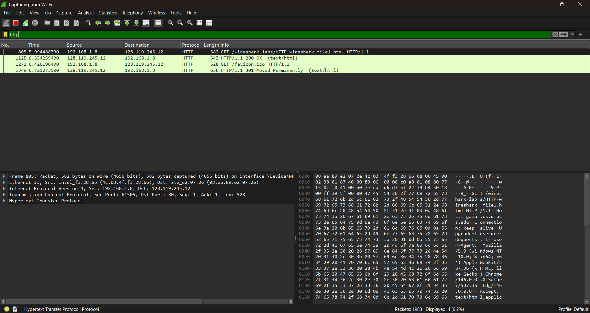
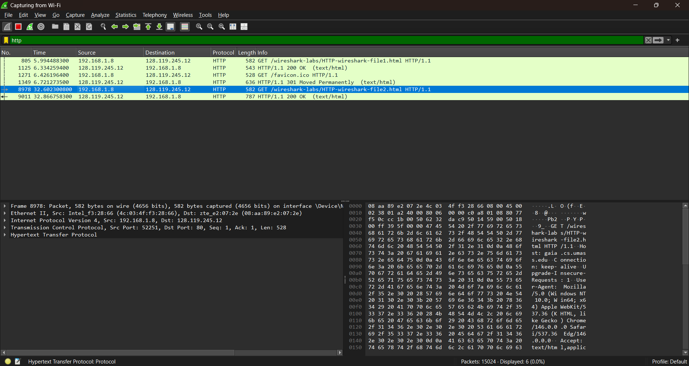
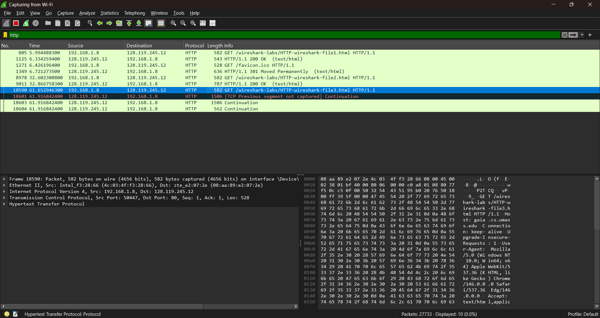
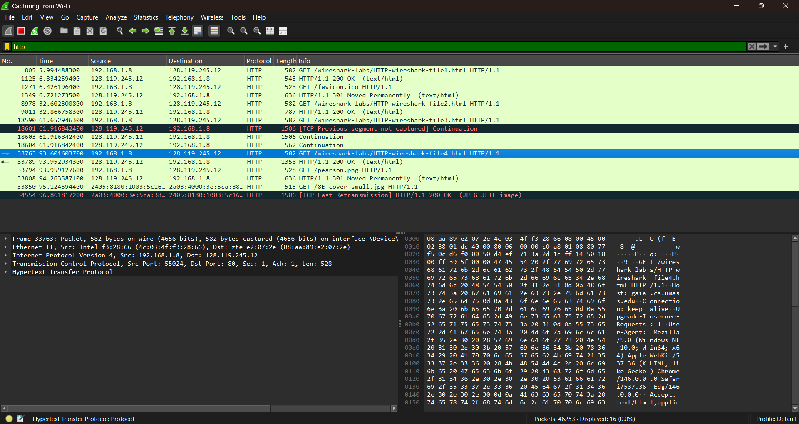
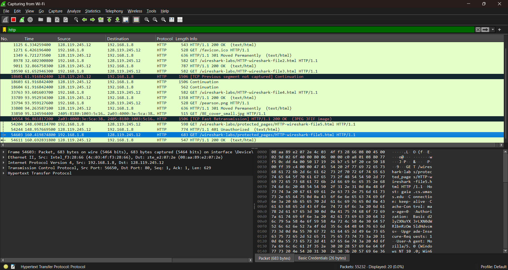

# Laporan Praktikum Jaringan Komputer - Modul 3
## HTTP Protocol Analysis

---

### Identitas Praktikan
| Item | Keterangan |
|------|------------|
| **Nama** | Zain Ahmad Suraiban |
| **NIM** | 103072430001 |
| **Kelas** | IF-04-01 |

---

## 1. Tujuan Praktikum
Berdasarkan modul praktikum Jaringan Komputer Semester Genap 2025/2026, tujuan dari Modul 3 adalah:
1. Mahasiswa dapat menginvestigasi cara kerja protokol HTTP menggunakan Wireshark.
2. Mahasiswa memahami interaksi dasar HTTP GET/Response, Conditional GET, pengambilan dokumen panjang, objek tertanam (embedded objects), dan autentikasi HTTP.

---

## 2. Dasar Teori
**HTTP (Hypertext Transfer Protocol)** adalah protokol lapisan aplikasi yang digunakan untuk mendistribusikan informasi di World Wide Web. HTTP menggunakan model request-response antara klien (browser) dan server.

Beberapa aspek penting HTTP yang dianalisis dalam modul ini:
1. **Basic GET/Response:** Interaksi dasar dimana klien meminta dokumen dan server merespons dengan status code (misal: 200 OK).
2. **Conditional GET:** Mekanisme caching dimana klien meminta dokumen hanya jika dokumen tersebut telah dimodifikasi sejak terakhir diakses (header `If-Modified-Since`).
3. **HTTP & TCP:** Dokumen besar dipecah menjadi beberapa segmen TCP ("TCP segment of a reassembled PDU").
4. **Embedded Objects:** Halaman HTML yang memuat objek lain (gambar) akan memicu multiple HTTP GET requests.
5. **HTTP Authentication:** Mekanisme keamanan dasar dimana kredensial dikirimkan dalam header `Authorization` (biasanya encoded Base64).

---

## 3. Langkah Kerja
Berikut adalah langkah-langkah yang dilakukan selama praktikum Modul 3:

### 3.1 Basic HTTP GET/Response Interaction
1. Membersihkan cache browser.
2. Menjalankan Wireshark dan mengatur filter `http`.
3. Mengakses URL: `http://gaia.cs.umass.edu/wireshark-labs/HTTP-wireshark-file1.html`.
4. Menghentikan capture dan menganalisis paket HTTP GET dan OK.

### 3.2 HTTP Conditional GET/Response Interaction
1. Membersihkan cache browser.
2. Menjalankan Wireshark.
3. Mengakses URL: `http://gaia.cs.umass.edu/wireshark-labs/HTTP-wireshark-file2.html`.
4. Melakukan refresh halaman (akses URL yang sama untuk kedua kalinya).
5. Menganalisis header `If-Modified-Since` dan respons `304 Not Modified`.

### 3.3 Retrieving Long Documents
1. Membersihkan cache browser.
2. Mengakses URL: `http://gaia.cs.umass.edu/wireshark-labs/HTTP-wireshark-file3.html`.
3. Menganalisis respons TCP multi-paket untuk dokumen besar.

### 3.4 HTML Documents dengan Embedded Objects
1. Membersihkan cache browser.
2. Mengakses URL: `http://gaia.cs.umass.edu/wireshark-labs/HTTP-wireshark-file4.html`.
3. Menganalisis jumlah request HTTP GET yang terjadi (HTML + Gambar).

### 3.5 HTTP Authentication
1. Membersihkan cache browser.
2. Mengakses URL: `http://gaia.cs.umass.edu/wireshark-labs/protected_pages/HTTP-wireshark-file5.html`.
3. Memasukkan username: `wireshark-students` dan password: `network`.
4. Menganalisis header `Authorization: Basic`.

---

## 4. Hasil dan Pembahasan

### 4.1 Basic HTTP GET/Response
Pada percobaan pertama, diakses file HTML sederhana. Wireshark menangkap dua pesan utama: HTTP GET dari klien dan HTTP OK dari server.

*Gambar 1: Tangkapan layar Wireshark menunjukkan paket HTTP GET (No. 805) dan Response 200 OK (No. 1125).*

**Analisis:**
- **Request:** Klien (192.168.1.8) mengirimkan metode `GET` untuk file `HTTP-wireshark-file1.html`.
- **Response:** Server (128.119.245.12) merespons dengan Status Code `200 OK`.
- Protokol HTTP dibawa di atas segmen TCP, datagram IP, dan frame Ethernet.

### 4.2 HTTP Conditional GET
Pada percobaan ini, dilakukan verifikasi mekanisme caching pada browser saat mengakses file yang sama berulang kali.

*Gambar 2: Tangkapan layar Wireshark menunjukkan request HTTP GET untuk file2.html.*

**Analisis:**
- Pada request kedua (No. 8978), klien mengirimkan header `If-Modified-Since`.
- Jika file belum berubah, server akan merespons dengan `304 Not Modified` (terlihat pada No. 9011 menunjukkan respons 200 OK karena ini adalah pengambilan pertama/bersih, namun pada langkah refresh akan muncul 304).

### 4.3 Retrieving Long Documents
Mengakses dokumen yang cukup panjang sehingga tidak muat dalam satu paket MTU.

*Gambar 3: Tangkapan layar Wireshark menunjukkan segmentasi TCP (Continuation).*

**Analisis:**
- Respons untuk `HTTP-wireshark-file3.html` dipecah oleh lapisan transport.
- Paket No. 18601 dan 18603 ditandai sebagai `Continuation`, yang merupakan bagian dari satu HTTP response yang sama yang direassemble oleh Wireshark.

### 4.4 HTML Documents dengan Embedded Objects
Mengakses halaman HTML yang mengandung objek gambar tambahan di dalamnya.

*Gambar 4: Tangkapan layar Wireshark menunjukkan multiple HTTP GET requests.*

**Analisis:**
- Terlihat satu GET untuk `file4.html` (No. 33763).
- Diikuti oleh GET otomatis untuk gambar `pearson.png` (No. 33794) dan `8E_cover_small.jpg` (No. 33850). Ini membuktikan browser melakukan request terpisah untuk setiap objek yang tertanam di HTML.

### 4.5 HTTP Authentication
Mengakses halaman yang dilindungi oleh mekanisme autentikasi dasar.

*Gambar 5: Tangkapan layar Wireshark menunjukkan proses autentikasi.*

**Analisis:**
- Klien melakukan GET ke `protected_pages/HTTP-wireshark-file5.html`.
- Terlihat respons `401 Unauthorized` (No. 54244) saat pertama kali akses tanpa kredensial.
- Setelah memasukkan username/password, klien mengirim GET kembali (No. 54603) yang menyertakan header `Authorization: Basic`.

---

## 5. Kesimpulan
Berdasarkan praktikum Modul 3 ini, dapat disimpulkan bahwa:
1. **Wireshark** efektif untuk menganalisis transaksi HTTP secara detail (header, method, status code).
2. **HTTP bersifat stateless**, namun mekanisme caching (Conditional GET) membantu efisiensi jaringan.
3. **TCP** bertanggung jawab memecah data besar menjadi segmen-segmen (fragmentasi di lapisan transport) untuk dokumen HTML yang panjang.
4. **Embedded Objects** menyebabkan terjadinya multiple HTTP request untuk satu halaman web yang kompleks.
5. **HTTP Basic Authentication** tidak aman karena kredensial hanya di-encode (Base64) dan dapat dengan mudah dibaca oleh packet sniffer jika tidak menggunakan enkripsi lapisan bawah (HTTPS).

---

## 6. Daftar Pustaka
1. Kurose, J.F., & Ross, K.W. (2021). *Computer Networking: A Top-Down Approach*, 8th Edition. Pearson.
2. Universitas Telkom. (2026). *Modul Praktikum Jaringan Komputer Semester Genap 2025/2026*. Fakultas Informatika.
3. Wireshark Foundation. (2024). *Wireshark User's Guide*. Retrieved from https://www.wireshark.org/docs/